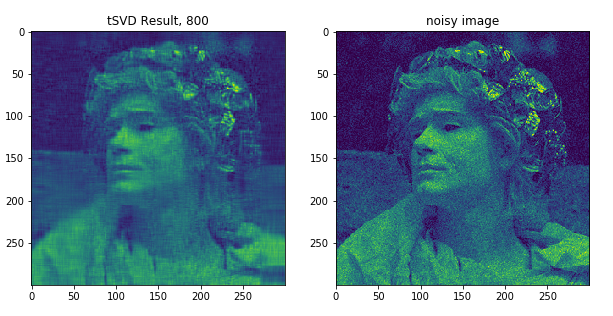

# tSVD Introduction

tSVD is a python library for calculating Singular Value Decomposition 
with threshold. User could provide input threshold for singular values 
if the threshold is known. 

## Installation

#### Include Eigen3

tSVD is a Python library based on [Eigen3](http://eigen.tuxfamily.org/index.php?title=Main_Page).
Before installing tSVD, please make sure that you have [Eigen3](http://eigen.tuxfamily.org/index.php?title=Main_Page)
installed in your system.

In MacOs, entrance point of the Eigen header file is normally under the path
``` /usr/local/include/eigen3 ```.

In Linuxs or Windows systems, the Eigen header file is normally under the path:
``` /usr/include/eigen3  ```.

Once you have Eigen3 in your system, setup this path in ```setup.py```.
 
For example :
```eigen_path = ['/usr/local/include/eigen3']```

#### Build Library

One can install tSVD by building Python extension using [pip](https://pypi.org/project/pip/) .

```bash
 python setup.py build_ext --inplace
 python setup.py bdist_wheel 
 cd dist && pip install tSVD-0.1-cp37-cp37m-macosx_10_15_x86_64.whl
```


## Usage

```python
from cylib.tSVD import *
import numpy as np

threshold = 1
accuracy = 0.0001
a = np.arange(1,16, dtype = np.float64).reshape(3,5)
u,s,vt = partial_svd(a, threshold, accuracy)
```

For this naive version, the input data type could only be limited to ```np.float64```

#### Demo: Image Denosing Using tSVD 

In the [Jupyter Notebook]() under ```demo/demo.ipynb```, you could find a 
demonstration of one of the applications of this library. With tSVD, we could 
use a threshold value to compress and decompress an image. Even more, selecting 
only the large singular values avoid expensive computation of the smaller eigen
values, and reduce the noises in the image.  




## Contributing
Pull requests are welcome. For major changes, please open an issue first to discuss what you would like to change.

Please make sure to update tests as appropriate.

## License
[MIT](https://choosealicense.com/licenses/mit/)